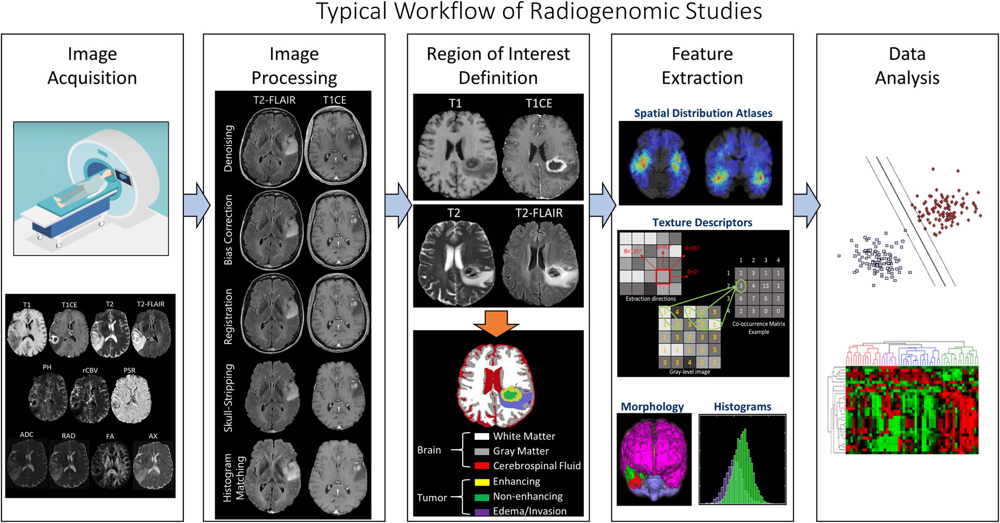

# Radiogenomics analysis on Dataset from Ivy Glioblastoma Atlas Project (Ivy GAP)
## What is Radiogenomics

$\quad$ Most existing radiogenomics studies aim to establish the relationship between tumor radiographic features  (eg,  tumor enhancement volume,  degree of necrosis)  and gene expression profiles or pathways.   These exploratory studies are designed to lay the groundwork for optimal study design, data collection, and analysis to help formulate relevant hypotheses for future research.  Exploratory studies are aimed at finding relevant mutations that may give rise to unique radiological phenotypes.  Ideally, radiogenomics studies are designed based on the following systematic approach:1) image acquisition; 2)image processing, including noise/artifact reduction, intensity and/or orientation standardization, coregistration of the multiparametric MRI scans; 3) ROI definition using manual annotation or (semi-)automatic segmentation; 4) feature extraction based on human-engineered (conventional radiomics) or deep-learning approaches; and5) data analysis, involving machine/deep-learning methods for feature selection, classification, and cross-validation.  This project focus on the last three steps, including ROI definition, also known as image segmentation, feature extraction, and data analysis [1]

## Dataest description [2]
$\quad$ This data collection consists of MRI/CT scan data for brain tumor patients that form the cohort for the resource Ivy Glioblastoma Atlas Project (Ivy GAP). There are 390 studies for 39 patients that include pre-surgery, post-surgery and follow up scans. The Ivy GAP is a collaborative partnership between the Ben and Catherine Ivy Foundation, which generously provided the financial support, the Allen Institute for Brain Science, and the Ben and Catherine Ivy Center for Advanced Brain Tumor Treatment. The goal of the project is to provide online resources to scientists and physicians dedicated to the development of innovative treatments and diagnostics that will enhance the quality of life and survival of patients with brain cancer. \\
$\quad$ These resources represent an unprecedented platform for exploring the anatomic and genetic basis of glioblastoma at the cellular and molecular levels. In addition to the DICOM images in TCIA there are two interactive databases linked together by de-identified tumor specimen numbers to facilitate comparisons across data modalities:

1. Ivy Glioblastoma Atlas Project - An open/public database providing in situ hybridization (ISH) and RNA sequencing (RNA-Seq) data, which map gene expression across the anatomic structures and putative cancer stem cell clusters in glioblastoma. The associated histological dataset is annotated and is suitable for neuropathological examination.
2. Ivy GAP Clinical and Genomic Database -  A database offering detailed clinical, genomic, and expression array data sets that are designed to elucidate the pathways involved in glioblastoma development and progression. This database requires registration for access.

## Which part this repositories focus on?
This repositorise focus on the last three steps.
1. GBM MRI image segmentation
2. Feature Extracion from ROI
3. Data anaylsis, including:
   * feature selection (Not applied yet)
   * GBM subtypes prediction,which is based on Verhaak et al. research in 2010 prediction (Accuracy:88%, )
   * gene expression profile generation(Not applied yet)

## File Structure
```
.
├── Data
│   ├── assessment
│   │   ├── confusion_matrix
│   │   ├── predict_mask
│   │   └── log.txt
│   ├── classfication results
│   │   ├── Simplified
│   │   │   ├── Test
│   │   │   │   └── ...
│   │   │   └── Train
│   │   │       └── ...
│   │   ├── Test
│   │   │   └── ...
│   │   ├── Train
│   │   │   └── ...
│   │   └── log.txt
│   ├── Images
│   │   ├── W1_FLAIR_AX
│   │   │   └── ...
│   │   └── ...
│   ├── Masks
│   │   ├── W1_FLAIR_AX
│   │   │   └── ...
│   │   └── ...
│   ├── train_monitor_image_AX
│   │   └── ...
│   ├── test_image_AX
│   │   └── ...
│   ├── feature extraction.csv
│   ├── GBM_MRI_Dataset.csv
│   ├── tumor_details.csv
│   ├── valid_data_to_classify.csv
│   └── Params.ymal
├── models
│   └── unet.pth
├── pictures
│   └── ...
├── assess.py
├── classification.py
├── data.py
├── feature_extraction.py
├── net.py
├── train.py
└── utils.py
```

# Reference
[1] Fathi Kazerooni, Anahita, et al. “Imaging Signatures of Glioblastoma Molecular Characteristics: A Radiogenomics Review.” Journal of Magnetic Resonance Imaging, vol. 52, no. 1, July 2020, pp. 54–69. DOI.org (Crossref), https://doi.org/10.1002/jmri.26907.

[2] https://wiki.cancerimagingarchive.net/pages/viewpage.action?pageId=22515597